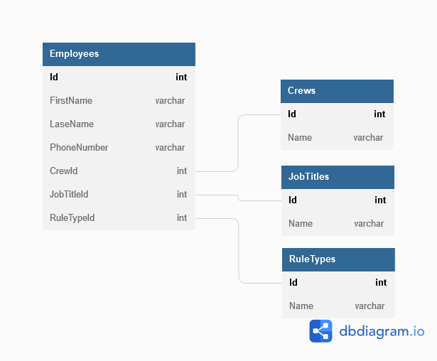

# Project Information

This project was originally created using Razor Forms. At that time I had not learned any front-end frameworks. Here I will be rebuilding this app using Angular.

<br/>

### Why did I want this app?

When I first created this app, I was Production Supervisor in a steel meltshop. This was a unionized workplace which means the overtime needs to be monitored to make sure you call in the proper guy in to avoid having grievances.. What we were using was excel spreadsheets that had to be modified with the new information every week. This excel document was divided in 14 different spreadsheets, 1 for every position we had to cover. The issue was some guys were on multiple pages, but when updating the sheet we had to make sure to change the same guy on every pages.. 

<br/>

### What did we need to change every week?

- Worked Overtime
- Refused Overtime
- Crew and Position changes (some guys were in the labour pool meaning they may change position and/or crew each week)
- Phone number changes
- Availability (Available, Vacation, Modified Work, Parental leave...)

<br />

### Why was excel not efficient?

We had to access the speadsheet from anywhere in the plant, meaning the spreadsheets where being saved on a shared drive. Some of the supervisors where not the best with computers and they would copy older documents over the newer "Good" version of the spreadsheet.

<br />

### Building the database

```
Initial database structure
```

<details>
  <summary>View Diagram</summary>

  
</details>

```
Adding properties to the Employee class
```


